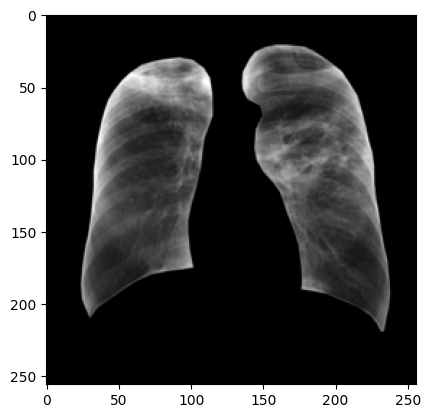
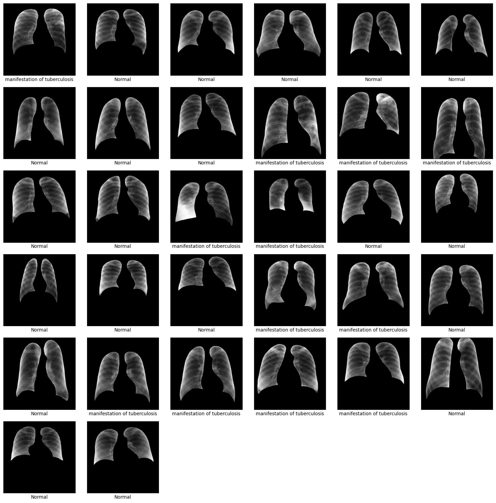
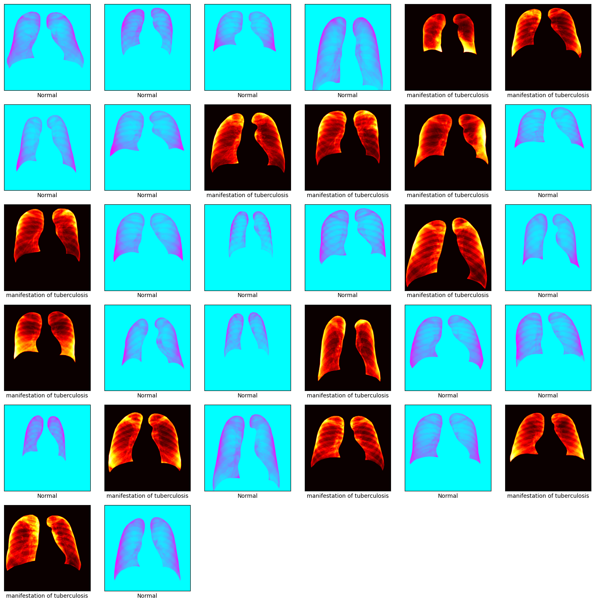
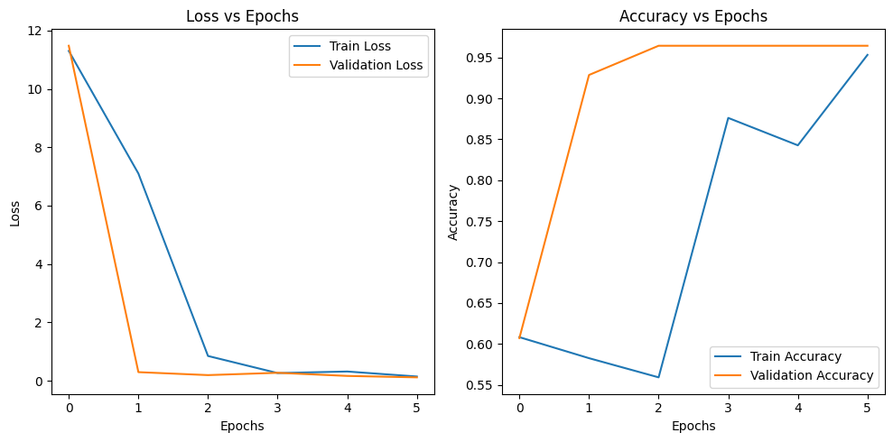
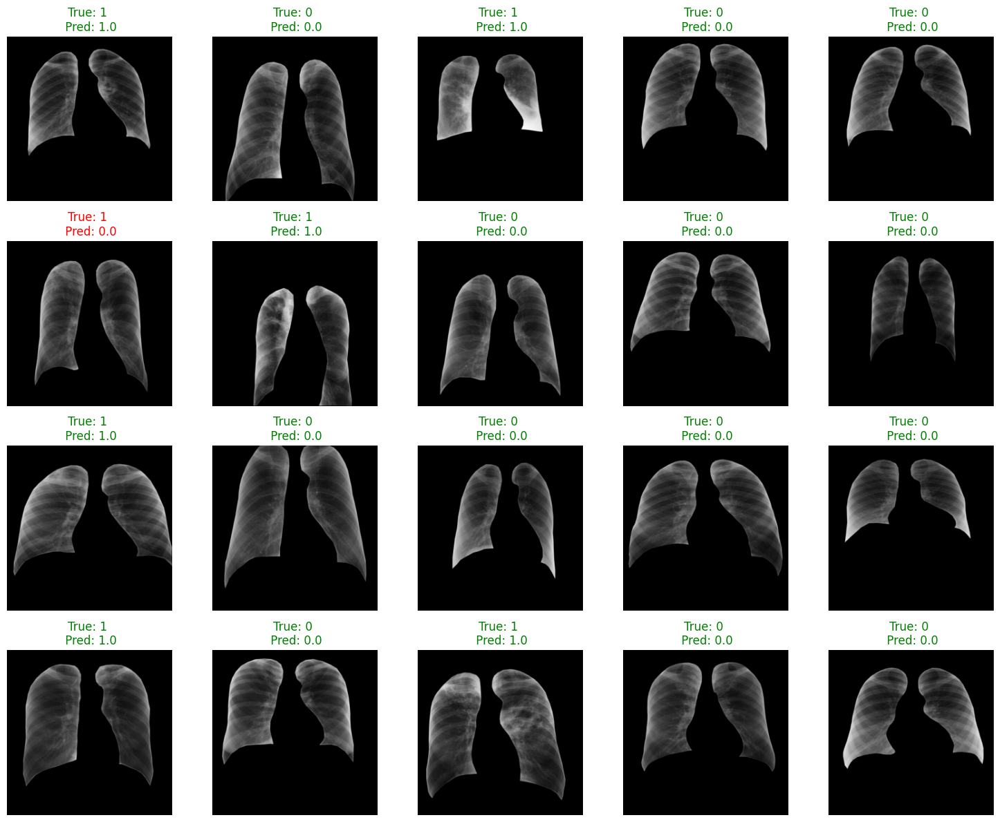

About the Dataset:

Description: The standard digital image database for Tuberculosis is created by the National Library of Medicine in collaboration with the Department of Health and Human Services, Montgomery County, Maryland, USA. The set contains data from X-rays collected under Montgomery County`s Tuberculosis screening program.
Number of X-rays:
- 58 cases with manifestation of tuberculosis, and
- 80 normal cases.
Image parameters:
- Format: PNG
- Matrix size is 4020 x 4892, or 4892 x 4020.
- The pixel spacing in vertical and horizontal directions is 0.0875 mm.
- Number of gray levels is 12bits.

Image file names are coded as MCUCXR_#####_0/1.png, where ‘0’ represents the normal and ‘1’ represents the abnormal lung.

The clinical readings for X-rays are saved as text file with the same file name as MCUCXR_#####_0/1.txt.Text file contains the patient`s age, sex and abnormality of the lung.
Lung Annotations

They manually generated the “gold standard” segmentations for the chest X-ray under the supervision of a radiologist.

They used the following conventions for outlining the lung boundaries: Both posterior and anterior ribs are readily visible in the CXRs; the part of the lung behind the heart is excluded.

They follow anatomical landmarks such as the boundary of the hearth, aortic arc/line, and pericardium line; and sharp costophrenic angle that follow the diaphragm boundary. Thry draw an inferred boundary when the pathology is severe and affects the morphological appearance of the lungs.

The lung boundaries (left and right) are in binary image format and have the same file name as chest X- rays ( e.g. .../left/MCUCXR_#####_0/1.png or .../right/MCUCXR_#####_0/1.png).

Citations:

1) Candemir S, Jaeger S, Musco J, Xue Z, Karargyris A, Antani SK, Thoma GR, Palaniappan K. Lung segmentation in chest radiographs using anatomical atlases with nonrigid registration. IEEE Trans Med Imaging. 2014 Feb;33(2):577-90. doi: 10.1109/TMI.2013.2290491. PMID: 24239990
2) Jaeger S, Karargyris A, Candemir S, Folio L, Siegelman J, Callaghan FM, Xue Z, Palaniappan K, Singh RK, Antani SK. Automatic tuberculosis screening using chest radiographs. IEEE Trans Med Imaging. 2014 Feb;33(2):233-45. doi: 10.1109/TMI.2013.2284099. PMID: 24108713


0 --> Normal Lung

1 --> abnormal lung


```python
!pip install transformers
```

    Looking in indexes: https://pypi.org/simple, https://us-python.pkg.dev/colab-wheels/public/simple/
    Requirement already satisfied: transformers in /usr/local/lib/python3.10/dist-packages (4.30.2)
    Requirement already satisfied: filelock in /usr/local/lib/python3.10/dist-packages (from transformers) (3.12.2)
    Requirement already satisfied: huggingface-hub<1.0,>=0.14.1 in /usr/local/lib/python3.10/dist-packages (from transformers) (0.15.1)
    Requirement already satisfied: numpy>=1.17 in /usr/local/lib/python3.10/dist-packages (from transformers) (1.22.4)
    Requirement already satisfied: packaging>=20.0 in /usr/local/lib/python3.10/dist-packages (from transformers) (23.1)
    Requirement already satisfied: pyyaml>=5.1 in /usr/local/lib/python3.10/dist-packages (from transformers) (6.0)
    Requirement already satisfied: regex!=2019.12.17 in /usr/local/lib/python3.10/dist-packages (from transformers) (2022.10.31)
    Requirement already satisfied: requests in /usr/local/lib/python3.10/dist-packages (from transformers) (2.27.1)
    Requirement already satisfied: tokenizers!=0.11.3,<0.14,>=0.11.1 in /usr/local/lib/python3.10/dist-packages (from transformers) (0.13.3)
    Requirement already satisfied: safetensors>=0.3.1 in /usr/local/lib/python3.10/dist-packages (from transformers) (0.3.1)
    Requirement already satisfied: tqdm>=4.27 in /usr/local/lib/python3.10/dist-packages (from transformers) (4.65.0)
    Requirement already satisfied: fsspec in /usr/local/lib/python3.10/dist-packages (from huggingface-hub<1.0,>=0.14.1->transformers) (2023.6.0)
    Requirement already satisfied: typing-extensions>=3.7.4.3 in /usr/local/lib/python3.10/dist-packages (from huggingface-hub<1.0,>=0.14.1->transformers) (4.6.3)
    Requirement already satisfied: urllib3<1.27,>=1.21.1 in /usr/local/lib/python3.10/dist-packages (from requests->transformers) (1.26.16)
    Requirement already satisfied: certifi>=2017.4.17 in /usr/local/lib/python3.10/dist-packages (from requests->transformers) (2023.5.7)
    Requirement already satisfied: charset-normalizer~=2.0.0 in /usr/local/lib/python3.10/dist-packages (from requests->transformers) (2.0.12)
    Requirement already satisfied: idna<4,>=2.5 in /usr/local/lib/python3.10/dist-packages (from requests->transformers) (3.4)


```python
%cd /content/drive/MyDrive
```

    /content/drive/MyDrive


```python
import os
import torch
from torchvision.transforms import Compose, ToTensor, Normalize
from transformers import BertTokenizer, BertModel
from torch.utils.data import Dataset
from PIL import Image
from torch.optim import Adam
from torch.nn import BCEWithLogitsLoss
from torch.utils.data import DataLoader
import torch.nn as nn
from torchvision import transforms

```


```python
from transformers import BertModel, BertTokenizer

class TuberculosisDataset(Dataset):
    def __init__(self, root_dir):
        self.root_dir = root_dir
        self.tokenizer = BertTokenizer.from_pretrained('bert-base-uncased')
        self.model = BertModel.from_pretrained('bert-base-uncased')

        self.image_files = sorted(os.listdir(os.path.join(root_dir, "CXR_png")))
        self.left_mask_files = sorted(os.listdir(os.path.join(root_dir, "ManualMask", "leftMask")))
        self.right_mask_files = sorted(os.listdir(os.path.join(root_dir, "ManualMask", "rightMask")))
        self.text_files = sorted(os.listdir(os.path.join(root_dir, "ClinicalReadings")))


         # Ensuring that all lists are of the same length
        min_len = min(len(self.image_files), len(self.left_mask_files), len(self.right_mask_files), len(self.text_files))
        self.image_files = self.image_files[:min_len]
        self.left_mask_files = self.left_mask_files[:min_len]
        self.right_mask_files = self.right_mask_files[:min_len]
        self.text_files = self.text_files[:min_len]
        self.image_transform = transforms.Compose([
            transforms.ToPILImage(),
            transforms.Resize((256, 256)),
            transforms.ToTensor()
        ])

        self.mask_transform = transforms.Compose([
            transforms.ToPILImage(),
            transforms.Resize((256, 256)),
            transforms.ToTensor()
        ])

    def __len__(self):
        return len(self.image_files)

    def __getitem__(self, idx):
        # Load image and mask data
        image_file = self.image_files[idx]
        left_mask_file = self.left_mask_files[idx]
        right_mask_file = self.right_mask_files[idx]

        image = cv2.imread(os.path.join(self.root_dir, "CXR_png", image_file), cv2.IMREAD_GRAYSCALE)
        left_mask = cv2.imread(os.path.join(self.root_dir, "ManualMask", "leftMask", left_mask_file), cv2.IMREAD_GRAYSCALE)
        right_mask = cv2.imread(os.path.join(self.root_dir, "ManualMask", "rightMask", right_mask_file), cv2.IMREAD_GRAYSCALE)

        # Combine left and right masks into a single mask
        mask = np.maximum(left_mask, right_mask)

        # apply transforms to the image and mask
        image = self.image_transform(image)
        mask = self.mask_transform(mask)

        # Apply the mask to the image
        image = image * mask

        # Load and preprocess text data
        text_file = self.text_files[idx]
        text = open(os.path.join(self.root_dir, "ClinicalReadings", text_file)).read()
        inputs = self.tokenizer.encode_plus(text, return_tensors='pt', max_length=512, truncation=True)
        outputs = self.model(**inputs)

        # Using the BERT model's final hidden state (i.e., embeddings) as our text features
        # Also, we will take the mean of the all token embeddings to handle texts of different length
        text_features = outputs.last_hidden_state.mean(dim=1)

        # Extract the label from the image file name (last character before .png)
        label = int(image_file.split('_')[-1][0])

        return image, text_features, label

# Create a Dataset
dataset = TuberculosisDataset(root_dir="MontgomerySet")

# Split the dataset into train and test
train_size = int(0.8 * len(dataset))
test_size = len(dataset) - train_size
train_dataset, test_dataset = torch.utils.data.random_split(dataset, [train_size, test_size])

# Create a DataLoader
train_loader = DataLoader(train_dataset, batch_size=32, shuffle=True)
test_loader = DataLoader(test_dataset, batch_size=32, shuffle=False)

```


    Downloading (…)solve/main/vocab.txt:   0%|          | 0.00/232k [00:00<?, ?B/s]


    Downloading (…)okenizer_config.json:   0%|          | 0.00/28.0 [00:00<?, ?B/s]


    Downloading (…)lve/main/config.json:   0%|          | 0.00/570 [00:00<?, ?B/s]


    Downloading model.safetensors:   0%|          | 0.00/440M [00:00<?, ?B/s]


    Some weights of the model checkpoint at bert-base-uncased were not used when initializing BertModel: ['cls.seq_relationship.bias', 'cls.predictions.bias', 'cls.predictions.transform.LayerNorm.bias', 'cls.seq_relationship.weight', 'cls.predictions.transform.dense.bias', 'cls.predictions.transform.LayerNorm.weight', 'cls.predictions.transform.dense.weight']
    - This IS expected if you are initializing BertModel from the checkpoint of a model trained on another task or with another architecture (e.g. initializing a BertForSequenceClassification model from a BertForPreTraining model).
    - This IS NOT expected if you are initializing BertModel from the checkpoint of a model that you expect to be exactly identical (initializing a BertForSequenceClassification model from a BertForSequenceClassification model).


```python
import matplotlib.pyplot as plt
import cv2
import numpy as np

# Get one batch of images and labels
a,b, c = next(iter(train_loader))

# Visualize the first image in the batch
# Permute the tensor dimensions to match the format expected by imshow
# Also, detach the tensor from its gradient computation graph
image = a[0].squeeze().detach().numpy()

plt.imshow(image, cmap='gray')
plt.show()

# Print the corresponding label
print("Label:", c[0].item())

```


    

    


    Label: 1


```python
import math
import matplotlib.pyplot as plt
import numpy as np

def show_images(images, labels):
    batch_size = len(images)
    # Calculate grid size to show all images
    grid_size = math.ceil(math.sqrt(batch_size))
    plt.figure(figsize=(15, 15))
    for i, image in enumerate(images):
        plt.subplot(grid_size, grid_size, i + 1, xticks=[], yticks=[])
        image = image.numpy().transpose((1, 2, 0))
        plt.imshow(image, cmap='gray')
        plt.xlabel(f'{labels[i]}')
    plt.tight_layout()
    plt.show()

# Get a batch of training data
inputs, text_features, classes = next(iter(train_loader))

# Define your class names
class_names = {0: 'Normal', 1: 'manifestation of tuberculosis'}

# Convert labels to class names
labels = [class_names[int(x)] for x in classes.numpy().flatten()]

# Show images
show_images(inputs, labels)

```


    

    


```python
import math
import matplotlib.pyplot as plt
import numpy as np

def show_images(images, labels):
    batch_size = len(images)
    grid_size = math.ceil(math.sqrt(batch_size))

    plt.figure(figsize=(15, 15))
    for i, image in enumerate(images):
        plt.subplot(grid_size, grid_size, i + 1, xticks=[], yticks=[])
        image = image.numpy().transpose((1, 2, 0))
        cmap_choice = 'hot' if labels[i] == 'manifestation of tuberculosis' else 'cool'
        plt.imshow(image, cmap=cmap_choice)
        plt.xlabel(f'{labels[i]}')
    plt.tight_layout()
    plt.show()

# Get a batch of training data
inputs, text_features, classes = next(iter(train_loader))

# Define your class names
class_names = {0: 'Normal', 1: 'manifestation of tuberculosis'}

# Convert labels to class names
labels = [class_names[int(x)] for x in classes.numpy().flatten()]

# Show images
show_images(inputs, labels)

```


    

    


```python
image, clinical_text_features, Label = next(iter(train_loader))

print(f"Image shape: {image.shape} -> [batch_size, color_channels, height, width]")
print(f"clinical text feature shape: {clinical_text_features.shape}")
print(f"Label shape: {Label.shape}")
```

    Image shape: torch.Size([32, 1, 256, 256]) -> [batch_size, color_channels, height, width]
    clinical text feature shape: torch.Size([32, 1, 768])
    Label shape: torch.Size([32])


```python
class MultiModalModel(nn.Module):
    def __init__(self):
        super(MultiModalModel, self).__init__()
        self.cnn_model = nn.Sequential(
            nn.Conv2d(1, 32, kernel_size=3, stride=1, padding=1),
            nn.ReLU(inplace=True),
            nn.MaxPool2d(kernel_size=2, stride=2),
            nn.Conv2d(32, 64, kernel_size=3, stride=1, padding=1),
            nn.ReLU(inplace=True),
            nn.MaxPool2d(kernel_size=2, stride=2),
            nn.Flatten()
        )

        self.fc1 = nn.Linear(64 * 64 * 64, 256)
        self.fc2 = nn.Linear(768, 256)

        self.fc3 = nn.Linear(256 + 256, 1)

    def forward(self, image, text_features):
        image_out = self.cnn_model(image)
        image_out = self.fc1(image_out)

        text_out = self.fc2(text_features.squeeze(1))

        combined = torch.cat([image_out, text_out], dim=1)

        out = self.fc3(combined)

        return out

```


```python
# Install torchinfo if it's not available
try:
    import torchinfo
except ImportError:
    !pip install torchinfo
    import torchinfo

# Create an instance of MultiModalModel
model = MultiModalModel()

# Use torchinfo to print model summary
torchinfo.summary(model, input_size=[(32, 1, 256, 256), (32, 1, 768)])


```

    Looking in indexes: https://pypi.org/simple, https://us-python.pkg.dev/colab-wheels/public/simple/
    Collecting torchinfo
      Downloading torchinfo-1.8.0-py3-none-any.whl (23 kB)
    Installing collected packages: torchinfo
    Successfully installed torchinfo-1.8.0


    ==========================================================================================
    Layer (type:depth-idx)                   Output Shape              Param #
    ==========================================================================================
    MultiModalModel                          [32, 1]                   --
    ├─Sequential: 1-1                        [32, 262144]              --
    │    └─Conv2d: 2-1                       [32, 32, 256, 256]        320
    │    └─ReLU: 2-2                         [32, 32, 256, 256]        --
    │    └─MaxPool2d: 2-3                    [32, 32, 128, 128]        --
    │    └─Conv2d: 2-4                       [32, 64, 128, 128]        18,496
    │    └─ReLU: 2-5                         [32, 64, 128, 128]        --
    │    └─MaxPool2d: 2-6                    [32, 64, 64, 64]          --
    │    └─Flatten: 2-7                      [32, 262144]              --
    ├─Linear: 1-2                            [32, 256]                 67,109,120
    ├─Linear: 1-3                            [32, 256]                 196,864
    ├─Linear: 1-4                            [32, 1]                   513
    ==========================================================================================
    Total params: 67,325,313
    Trainable params: 67,325,313
    Non-trainable params: 0
    Total mult-adds (G): 12.52
    ==========================================================================================
    Input size (MB): 8.49
    Forward/backward pass size (MB): 805.44
    Params size (MB): 269.30
    Estimated Total Size (MB): 1083.23
    ==========================================================================================


```python
def binary_accuracy(preds, y):
    # Round predictions to the closest integer (0 or 1)
    rounded_preds = torch.round(torch.sigmoid(preds))
    correct = (rounded_preds == y).float()  # Convert into float for division
    acc = correct.sum() / len(correct)
    return acc

def train(model, iterator, optimizer, criterion, device):
    epoch_loss = 0
    epoch_acc = 0
    model.train()

    for batch in iterator:
        images, text_features, labels = batch
        images = images.to(device)
        text_features = text_features.to(device)
        labels = labels.squeeze().float().to(device)

        optimizer.zero_grad()

        outputs = model(images, text_features).squeeze().float()

        loss = criterion(outputs, labels)
        acc = binary_accuracy(outputs, labels)

        loss.backward()
        optimizer.step()

        epoch_loss += loss.item()
        epoch_acc += acc.item()

    return epoch_loss / len(iterator), epoch_acc / len(iterator)

def evaluate(model, iterator, criterion, device):
    epoch_loss = 0
    epoch_acc = 0
    model.eval()

    with torch.no_grad():
        for batch in iterator:
            images, text_features, labels = batch
            images = images.to(device)
            text_features = text_features.to(device)
            labels = labels.squeeze().float().to(device)

            outputs = model(images, text_features).squeeze().float()

            loss = criterion(outputs, labels)
            acc = binary_accuracy(outputs, labels)

            epoch_loss += loss.item()
            epoch_acc += acc.item()

    return epoch_loss / len(iterator), epoch_acc / len(iterator)

train_losses = []
train_accuracies = []
valid_losses = []
valid_accuracies = []

# Use the defined model, optimizer, and loss function
model = MultiModalModel()
optimizer = torch.optim.Adam(model.parameters())
criterion = nn.BCEWithLogitsLoss()

device = torch.device('cuda' if torch.cuda.is_available() else 'cpu')
model = model.to(device)
criterion = criterion.to(device)

num_epochs = 6

# Main training loop
for epoch in range(num_epochs):
    train_loss, train_acc = train(model, train_loader, optimizer, criterion, device)
    valid_loss, valid_acc = evaluate(model, test_loader, criterion, device)
    train_losses.append(train_loss)
    train_accuracies.append(train_acc)
    valid_losses.append(valid_loss)
    valid_accuracies.append(valid_acc)
    print(f'Epoch: {epoch+1:02}')
    print(f'\tTrain Loss: {train_loss:.4f} | Train Acc: {train_acc*100:.2f}%')
    print(f'\t Val. Loss: {valid_loss:.4f} |  Val. Acc: {valid_acc*100:.2f}%')

```

    Epoch: 01
    	Train Loss: 11.3003 | Train Acc: 60.83%
    	 Val. Loss: 11.4771 |  Val. Acc: 60.71%
    Epoch: 02
    	Train Loss: 7.0988 | Train Acc: 58.26%
    	 Val. Loss: 0.2929 |  Val. Acc: 92.86%
    Epoch: 03
    	Train Loss: 0.8466 | Train Acc: 55.92%
    	 Val. Loss: 0.1911 |  Val. Acc: 96.43%
    Epoch: 04
    	Train Loss: 0.2609 | Train Acc: 87.61%
    	 Val. Loss: 0.2704 |  Val. Acc: 96.43%
    Epoch: 05
    	Train Loss: 0.3146 | Train Acc: 84.26%
    	 Val. Loss: 0.1631 |  Val. Acc: 96.43%
    Epoch: 06
    	Train Loss: 0.1432 | Train Acc: 95.31%
    	 Val. Loss: 0.1140 |  Val. Acc: 96.43%


```python
# Plotting loss
plt.figure(figsize=(10, 5))
plt.subplot(1, 2, 1)
plt.plot(range(num_epochs), train_losses, label='Train Loss')
plt.plot(range(num_epochs), valid_losses, label='Validation Loss')
plt.xlabel('Epochs')
plt.ylabel('Loss')
plt.title('Loss vs Epochs')
plt.legend()

# Plotting accuracy
plt.subplot(1, 2, 2)
plt.plot(range(num_epochs), train_accuracies, label='Train Accuracy')
plt.plot(range(num_epochs), valid_accuracies, label='Validation Accuracy')
plt.xlabel('Epochs')
plt.ylabel('Accuracy')
plt.title('Accuracy vs Epochs')
plt.legend()

plt.tight_layout()
plt.show()
```


    

    


```python
num_images_to_show = 5  # number of images per column
num_rows = 4  # number of rows

# Placeholder lists for images, labels, and predictions
all_images = []
all_labels = []
all_preds = []

model.eval()
with torch.no_grad():
    for i, batch in enumerate(test_loader):
        # Extract inputs and labels from batch
        images, text_features, labels = batch

        # Move inputs and labels to the specified device
        images = images.to(device)
        text_features = text_features.to(device)

        labels = labels.squeeze().to(device)

        outputs = model(images, text_features).squeeze().float()

        # Forward pass and get predictions
        rounded_preds = torch.round(torch.sigmoid(outputs))

        # Move images and labels back to CPU for plotting
        images = images.cpu()
        labels = labels.cpu()
        preds = rounded_preds.cpu()

        # Convert tensor images to numpy images
        images = images.numpy()
        # Also convert single channel images to 3 channel images for visualization
        images = np.repeat(images, 3, axis=1)
        # Images in pytorch are channel-first, we transpose them to be height x width x channel
        images = np.transpose(images, (0, 2, 3, 1))

        all_images.extend(images)
        all_labels.extend(labels.tolist())
        all_preds.extend(preds.tolist())

        if len(all_images) >= num_images_to_show * num_rows:
            break

fig, axes = plt.subplots(num_rows, num_images_to_show, figsize=(15,3*num_rows))  # Adjust figure size here

for i in range(num_rows):
    for j in range(num_images_to_show):
        image_idx = i*num_images_to_show + j
        axes[i, j].imshow(all_images[image_idx])
        title_text = f"True: {all_labels[image_idx]} \n Pred: {all_preds[image_idx]}"
        if all_labels[image_idx] == all_preds[image_idx]:
            color = 'green'  # Correct prediction
        else:
            color = 'red'  # Incorrect prediction
        axes[i, j].set_title(title_text, color=color)
        axes[i, j].axis('off')

plt.tight_layout()
plt.show()

```


    

    

